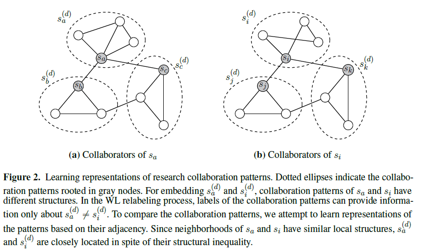

# Collaboration2Vec

### Abstract
<p align="justify">This study aims to validate whether the research performance of scholars correlates with how the scholars work together. Although the most straigthforward approaches are centrality measures of community detection, scholars mostly participate in multiple research groups and have different roles in each group. Thus, we concentrate on the substructures of co-authorship networks rooted in each scholar that cover (i) overlapping of the research groups on the scholar and (ii) roles of the scholar in the groups. This study calls the substructures 'collaboration patterns' and applies subgraph embedding methods to discover and represent the collaboration patterns. Based on embedding the collaboration patterns, we hvae clustered scholars according to their collaboration styles. Then, we have examined whether scholars in each cluster have similar research performance, using the quantitative indicators. The coherence of the indicators cannot be solid proof for validation the correlation between collaboration and performance. Nevertheless, the examination for clusters has exhibited that the collaboration patterns can reflect research styles of scholars. This information will enable us to predict the research performance more accurately since the research styles are more consistent and sustainable features of scholars than a few high-impact publications.
</p>
<p align="center">
  
</p>

This repository provides an implementation for learning representation of research collaboration patterns as it is described in:
> Hyeon-Ju Jeon, O-Joun Lee, Jason J. Jung:
> Is Performance of Scholars Correlated to their Research Collaboration Patterns? 
> in Proceedings the 6th Workshop on Big Scholarly Data (BigScholar 2019), co-located with the 28th ACM International Conference on Information and Knowledge Management (CIKM 2019), Beijing, China, 11/2019.

### Requirements

The codebase is implemented in Python 3.6.1 | Anaconda 4.6.14 (64-bit). Package versions used for development are just below.
```
jsonschema        2.6.0
numpy             1.15.4
pandas            0.23.4
texttable         1.5.0
gensim            3.8.0
seaborn           0.9.0
matplotlib        2.2.3
```
The original subgraph2vec implementation is available [[here]](https://github.com/MLDroid/subgraph2vec_gensim).
This is developed on top of "gensim" python package.


### Datasets

We collected bibliography data from [DBLP](https://dblp.uni-trier.de). Since the bibliography data is exessively massive, we restricted a collection range into the famous conferences in DBMS area (e.g., ICDE, SIGMOD, and VLDB) over the last five years. The dataset consists of rich bibliography information, including the authors, titles, publication year, venues, and so on. The number of citations for the collected papers is acquried from [Scopus](https://www.scopus.com).
In our co-authorship network, a node indicates a scholar, and each edge denotes whether two corresponding scholars have ever collaborated. Proximity indicates the proximity between two authors, which are measured by the number of co-authored publications.


### Options

Representation learning procedures are handled by `src_code/collaboraion_patterns_embedding.py` script that provides the following command line arguments.


## Contact ##
In case of queries, please email: higd963@gmail.com


